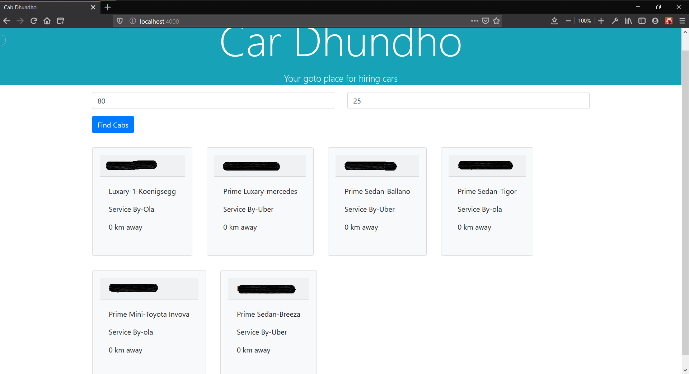

# Drivers Restful Api
### API to handle Drivers
---
This api is made using Nodejs, expressjs, mongoDB and postman.


You are required to put latitude and longitude of your current position and then api would return drivers which are available to hire and are nearest you.


---
```
1. GET  - /api/drivers
2. POST - /api/drivers
3. UPDATE - /api/drivers/id
4. DELETE - /api/drivers/id
```

